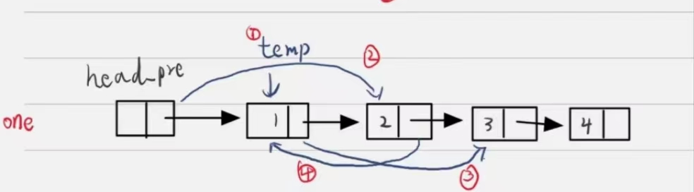
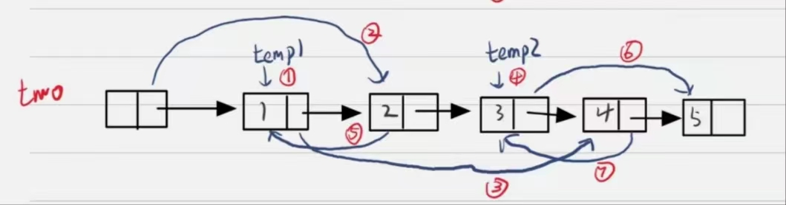

# 两两交换链表中的节点

## 1 每次交换一对节点

要点是递归调用，为了避免一直要判断下一个节点是否为空，我选择先遍历得出链表的总长度，然为为了减少边界情况的判断，我为输入的节点增加了个虚拟头节点`head_pre`



```cc
ListNode* swapPairs(ListNode* head) {
        auto*  head_pre=new ListNode{0,head};//定义首节点避免处理边界情况
        auto temp=head_pre;
        int size=0;//首先查询链表的长度
        while (temp->next!= nullptr)
        {
            temp=temp->next;
            size++;
        }
        //调用每次交换两对节点的递归函数
        swapPairs(head_pre,size);//重载函数
        auto result=head_pre->next;
        delete head_pre;//free内存
        return result;
    }
void swapPairs(ListNode*&  head,int size) {
        ListNode* temp;
        if(size>=2)   //如果没有需要调换，说明全部调换完毕，退出
        {//这4步实现了一对节点的调换，对应图片
            temp=head->next;//1
            head->next=temp->next;//2
            temp->next=head->next->next;//3
            head->next->next=temp;//4
            size-=2;
            swapPairs(head->next->next,size);
        }
    }
```

>执行耗时:4 ms,击败了55.64% 的C++用户
>内存消耗:7.3 MB,击败了67.46% 的C++用户

## 2 每次交换两对节点

利用批处理技巧较少调用




```cc
class Solution {
public:
    ListNode* swapPairs(ListNode* head) {
        auto*  head_pre=new ListNode{0,head};//定义首节点避免处理边界情况
        auto temp=head_pre;
        int size=0;//首先查询链表的长度
        while (temp->next!= nullptr)
        {
            temp=temp->next;
            size++;
        }
        //调用每次交换两对节点的递归函数
        swaptwoPairs(head_pre,size);
        auto result=head_pre->next;
        delete head_pre;//free内存
        return result;
    }
    //递归函数，每次进行两对节点的调换
     void swaptwoPairs(ListNode*&  head,int size) {
        ListNode* temp1,*temp2;
       //如果还有4个及以上还需调换
        if(size>=4)
        {//这7步实现了两对节点的调换，含义可以看笔记
            temp1=head->next;//1
            head->next=temp1->next;//2
            temp1->next=head->next->next->next;//3
            temp2=head->next->next;//4
            head->next->next=temp1;//5
            temp2->next=temp1->next->next;//6
            temp1->next->next=temp2;//7
            size-=4;    //减去调换完毕的，接着递归调用
            swaptwoPairs(head->next->next->next->next,size);
        }
        else
        {
            //如果没有2对需要调换，调用1对调换函数
            swapPairs(head,size);
        }
    }
    //递归函数，每次进行一对节点的调换
    void swapPairs(ListNode*&  head,int size) {
        ListNode* temp;
        if(size>=2)   //如果没有需要调换，说明全部调换完毕，退出
        {//这4步实现了一对节点的调换
            temp=head->next;//1
            head->next=temp->next;//2
            temp->next=head->next->next;//3
            head->next->next=temp;//4
            size-=2;
            swapPairs(head->next->next,size);
        }
    }
};
```

> 执行耗时:0 ms,击败了100.00% 的C++用户
> 内存消耗:7.3 MB,击败了60.08% 的C++用户