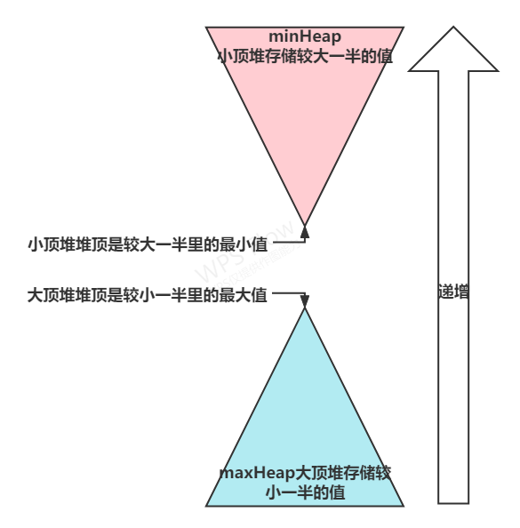

# 数据流的中位数

##  大小堆 优先队列

https://leetcode.cn/problems/find-median-from-data-stream/solution/qing-xi-tu-jie-jian-zhi-offer41-shu-ju-l-rpen/




```cc
class MedianFinder {
public:
    MedianFinder() {
    }

    void addNum(int num) {
        if(queue_big.empty()||num<queue_big.top())//如果为空或者小于大顶堆的堆顶
        {
            queue_big.push(num);//插入大顶堆
            if(queue_big.size()>queue_small.size()+1)//如果大顶堆的元素多于小顶堆的元素
            {
                queue_small.push(queue_big.top());//将大顶堆的堆顶元素插入小顶堆
                queue_big.pop();//删除大顶堆的堆顶元素
            }

        }
        else//如果大于大顶堆的堆顶
        {
            queue_small.push(num);//插入小顶堆
            if(queue_small.size()>queue_big.size()+1)//如果小顶堆的元素多于大顶堆的元素
            {
                queue_big.push(queue_small.top());//将小顶堆的堆顶元素插入大顶堆
                queue_small.pop();//删除小顶堆的堆顶元素
            }
        }
    }
    double findMedian() {
        if(queue_big.size()==queue_small.size())//如果两个堆的元素相等
        {
            return static_cast<double>(queue_big.top()+queue_small.top())/2.0;//返回两个堆顶元素的平均值
        }
        else if (queue_big.size()>queue_small.size())//如果大顶堆的元素多
        {
            return queue_big.top();
        }
        else
        {
            return queue_small.top();
        }
    }

    vector<int> nums;
    priority_queue<int,vector<int>,greater<>> queue_small;//小顶堆
    priority_queue<int> queue_big;//大顶堆

};
```


## 有序集合 + 双指针

可以使用有序集合维护这些数。我们把有序集合看作自动排序的数组，使用双指针指向有序集合中的中位数元素即可。当累计添加的数的数量为奇数时，双指针指向同一个元素。当累计添加的数的数量为偶数时，双指针分别指向构成中位数的两个数。

当我们尝试添加一个数 num 到数据结构中，我们需要分情况讨论：

- 初始有序集合为空时，我们直接让左右指针指向 num 所在的位置。
  - 有序集合为中元素为奇数时，left 和 right 同时指向中位数。如果 num 大于等于中位数，那么只要让 left 左移，否则让 right 右移即可。

- 有序集合为中元素为偶数时，left 和right 分别指向构成中位数的两个数。
  - 当 num 成为新的唯一的中位数，那么我们让 left 右移，right 左移，这样它们即可指向num 所在的位置；
  - 当 num 大于等于right，那么我们让 left 右移即可；
  - 当 num 小于 left 指向的值，那么我们让 right 左移


```cc
class MedianFinder {
public:
    MedianFinder()=default;
    void addNum(int num) {
        nums.insert(num);//插入,自动排序 multiset 特性，insert 插入不会使迭代器失效，而且如果num相等的数已经存在，则num会安排到此数++的位置
        if(nums.size()==1)//
        {
            left=nums.begin();//指向第一个元素
            right=nums.begin();//指向第一个元素
        }
        else if(nums.size()%2==0)//插入后为偶数，说明此前left和right指向同一个数
        {
            if(num<*left)//插入的数比左边的小
            {
                left--;//左边的指针左移
            }
            else if(num>*right)//插入的数比右边的大
            {
                ++right;
            }
            else//如果与left和right相等
            {
                right++;//right指向新填入的数
            }
        }
        else//插入后为奇数，说明此前left和right指向两个数（这两个数是有可能相等的）
        {
            if(num<*left)//小于left，此数只能插入到左边
            {
                --right;//right左移，与left指向一个数
            }
            else if(num>=*right)//大于等于right，此数只能插入到右边
            {
                ++left;//left右移，与right指向一个数
            }
            else//大于等于left，小于right，此数只能插入到rigth和left中间
            {
                ++left;//同时移动left，right，指向插入的数
                --right;
            }

        }

    }
    double findMedian() {
        return (*left+*right)/2.0;//返回中位数
    }
    multiset<int> nums;
    multiset<int>::iterator left,right;

};
```

