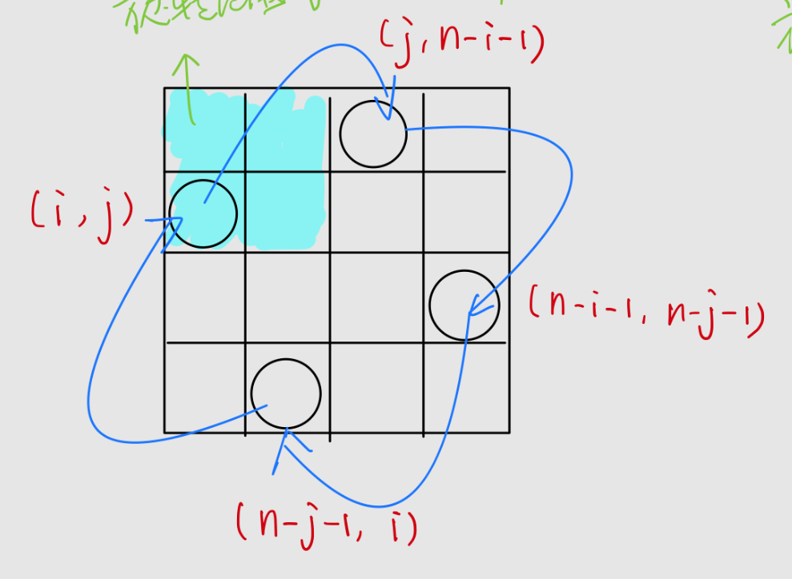

# 旋转图像

原地旋转的逻辑如下，图片借用[作者：user9269V](https://leetcode.cn/problems/rotate-image/solution/shu-xue-zhao-gui-lu-by-user9269v-h7fy/)



```cc
class Solution {
public:
    void rotate(vector<vector<int>>& matrix)
    {
        const int n_high=ceil(matrix.size()/2);//向上取整
        const int n_low=matrix.size()/2;//向下取整
        const int max_idx=matrix.size()-1;//用常量存储矩阵索引的最大值
        int temp=0;
        for(int i=n_high-1;i>=0;--i)
         //双层循环的边界分别选取0.5size的向上取整和向下取整，保证遍历全部的1/4
        {
            for(int j=0 ;j<n_low;++j)
            {
                //一次移动4个数据,具体移动方式
                temp=matrix[i][j];
                matrix[i][j]=matrix[max_idx-j][i];
                matrix[max_idx-j][i] = matrix[max_idx-i][max_idx-j];
                matrix[max_idx-i][max_idx-j] = matrix[j][max_idx-i];
                matrix[j][max_idx-i] = temp;
            }
        }
    }
};
```

>执行耗时:0 ms,击败了100.00% 的C++用户
>内存消耗:6.8 MB,击败了70.89% 的C++用户