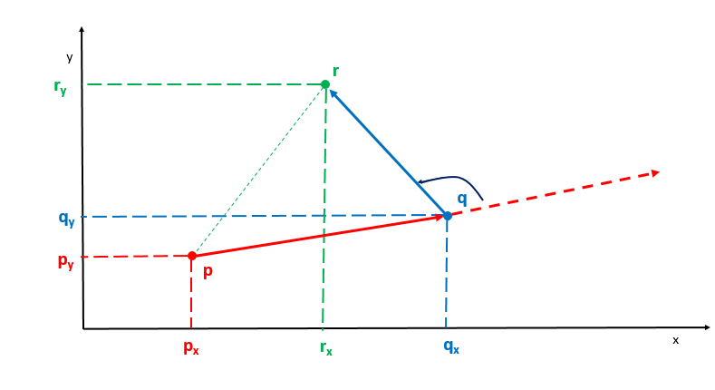

# 安装栅栏

## 方法一: Jarvis 算法

要从凸包上的某一点开始，比如从给定点集中最左边的点开始，例如最左的一点$A_1$ 。然后选择$A_2$点使得所有点都在向量$\overrightarrow{A_1A_2}$的左方或者右方，我们每次选择左方，需要比较所有点以$A_1$ 为原点的极坐标角度。然后以$A_2$为原点，重复这个步骤，依次找到$A_1A_2A_3A_4\dots$给定原点 p。

如何找到点 q，满足其余的点 r 均在向量 $\vec{pq}$ 的左边，我们使用「**向量叉积」**来进行判别



从上图中，我们可以观察到点 p，q 和 r 形成的向量相应地都是逆时针方向，向量 $\vec{pq}$  和 $\vec{qr}$ 旋转方向为逆时针，函数 cross(p,q,r) 返回值大于 0

$$ \begin{aligned}
c r o s s(p,q,r)& =\vec{p}q\times\vec{q}\vec{r}  \\
&=\begin{vmatrix}(q_x-p_x)&(q_y-p_y)\\ (r_x-q_x)&(r_y-q_y)\end{vmatrix} \\
&=(q_x-p_x)\times(r_y-q_y)-(q_y-p_y)\times(r_x-q_x)
\end{aligned}$$

```cc
class Solution {
public:
    /*
     * 求叉积
     * @param a
     * @param b
     * @param res
     * @return int
     *cross(a,b,r) =ab*br=(bx-ax)*(ry-by)-(by-ay)*(rx-bx)
     * */
    double cross( vector<int> &a, vector<int> &b, vector<int> &res)
    {
        return (b[0] - a[0]) * (res[1] - b[1]) - (b[1] - a[1]) * (res[0] - b[0]);
    }
    /*
     * */
    vector<vector<int>> outerTrees(vector<vector<int>>& trees) {
        const int n = trees.size();
        if (n < 4) {//小于3个点，直接返回
            return trees;
        }
        int leftMost=0;//最左边的点
        for (int i = 0; i < n; ++i)
        {
            //找到最左边的点   x坐标最小的点 或者 x坐标相同 y坐标最小的点 作为起点
            if (trees[i][0] < trees[leftMost][0]|| (trees[i][0] == trees[leftMost][0] && trees[i][1] < trees[leftMost][1]))
            {
                leftMost = i;
            }
        }
        vector<vector<int>> res={trees[leftMost]};//起点
        vector<bool> visited(n, false);//标记是否访问过
        int p = leftMost,q=(p+1)%n;// p为起点，q为下一个点
        do{
            visited[p]= true;//标记为访问过
            q=(p+1)%n;//
            for (int j = 0; j < n; ++j)//找到下一个点 q 点 使得其余的点均在向量 $\vec{pq}$ 的左边
            {
                if (cross(trees[p], trees[q], trees[j]) < 0)
                {
                    q=j;//j在向量pq的右边，即q在向量pj的左边，更新q 为j
                }
            }
            for (int i = 0; i < n; ++i)//找到所有在向量 $\vec{pq}$ 的延长线上的点，加入结果集
            {
                if (visited[i]||i==q) continue;//已经访问过的点 或者 q点 跳过
                if (cross(trees[p], trees[q], trees[i]) == 0)
                {
                    visited[i]=true;//在向量pq的延长线上的点，标记为访问过
                    res.push_back(trees[i]);//加入结果集
                }
            }
            if  (!visited[q])//q点没有访问过，加入结果集
            {
                res.emplace_back(trees[q]);
                visited[q] = true;
            }
            p=q;//更新p为q 继续迭代
        }
        while (p != leftMost);//当p回到起点时，结束迭代
        return res;
    }
};
```


## 方法二: Jarvis 算法

