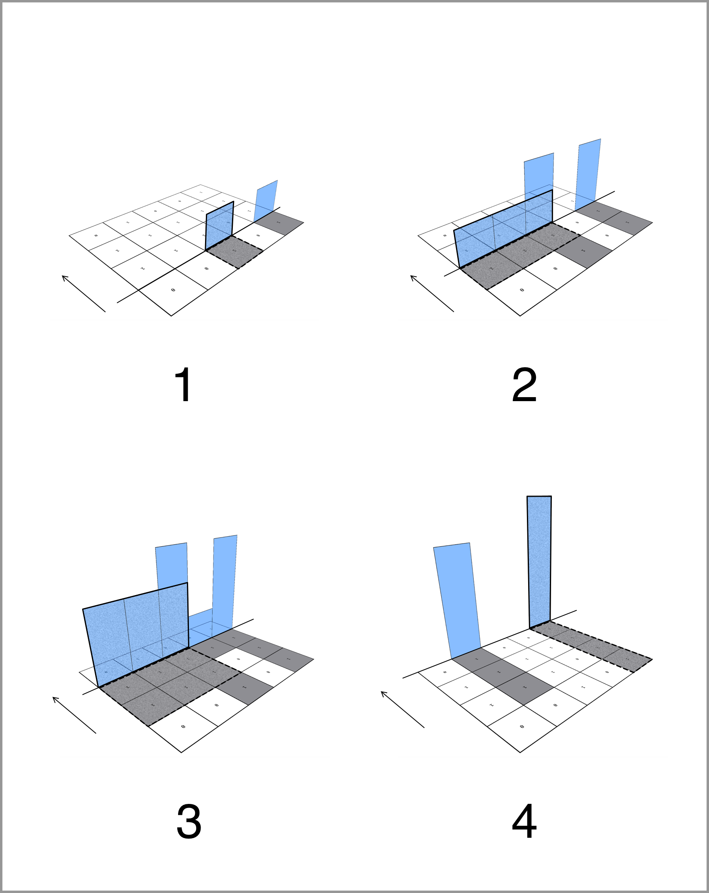

# 最大矩形

这道题目与 [#84 柱状图中最大的矩形](https://leetcode-cn.com/problems/largest-rectangle-in-histogram) 非常相似。把矩阵的每层当作柱状图的底线，向上连续1的个数为高度，[如图(作者:Jeremi)](https://leetcode.cn/problems/maximal-rectangle/solution/gryffindor-85-zui-da-ju-xing-by-jeremi-w6lo/)




    
```cc
class Solution {
public:
    int maximalRectangle(vector<vector<char>>& matrix)
    {
        if (matrix.size() == 0)return 0;
        const int n = matrix.size(), m = matrix[0].size();
        vector<vector<int>> height(n, vector<int>(m, 0));
        int max_area = 0;
        for (int i = 0; i < m; ++i)height[0][i] = matrix[0][i] - '0';
        for (int i = 1; i < n; ++i)//把矩阵的每层当作柱状图的底线，向上连续1的个数为高度，
        {
            for (int j = 0; j < m; ++j)
            {
                if (matrix[i][j] - '0')height[i][j] = height[i - 1][j] + 1;
                else height[i][j] = 0;
            }
        }
        for (int i = 0; i < n; ++i)//把hight的每层当柱状图，计算矩阵面积
        {
            max_area = max(max_area, largestRectangleArea(height[i]));
        }
        return max_area;
    }
//84题
    int largestRectangleArea(vector<int>& heights) {
        heights.emplace_back(0);//哨兵
        const int  lenght=heights.size();
        int rectArea=0,idx=0,temp_area;
        std::stack<int> h_list;//单调栈，不直接存放高度值，而是存放heights中高度的序列号
        h_list.emplace(0);//先加入一个头数据，因为添加了哨兵，所以不用考虑为空的情况
        for (int i = 0; i <lenght ; ++i)
        {
            if(heights[h_list.top()]<heights[i])//比栈顶大，直接入栈
            {
                h_list.push(i);
            }
            else if (heights[h_list.top()]>heights[i])//比栈顶小，依次弹出并计算区域，然后入栈
            {
                do
                {
                    idx=h_list.top();//存放弹出的序列号
                    temp_area=(i-idx)*heights[idx];//计算矩形区域
                    rectArea= temp_area>rectArea?temp_area:rectArea;//更新
                    h_list.pop();//弹出
                } while ((!h_list.empty())&& heights[h_list.top()]>heights[i]);//非空且需要插入的还比栈顶小，接着弹出
                //找到了在i左边，从左往右第一个大于heights[i]的位置，这两个位置间的矩形区域已经计算过了，而且对于这个区域外面两侧的部分来说,
                // 因为heights[idx]和 heights[i]的限制，矩形的最高高度就是heights[i], 所以改写heights[idx]高度并再次入栈
                heights[idx]=heights[i];
                h_list.push(idx);//再次入栈
            }
        }
        return rectArea;
    }
};
```


