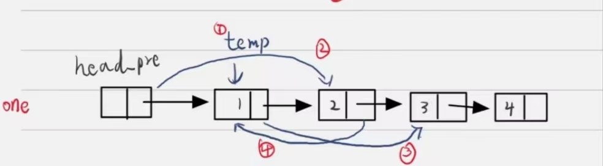

# 数组

### 有效的数独

数独

思路：先统计相同的数所在的位置，然后再对数在相同行、列、方格的出现的次数进行统计判断

```cc
class Solution {
public:
    bool isValidSudoku(vector<vector<char>>& board) {
        vector<std::pair<char,char>> num_pos[9]={};
        for(char i=0;i<9;++i)//先统计相同的数所在的位置
        {
            for (char j = 0; j <9 ; ++j)
            {//
                if(board[i][j]!='.') num_pos[board[i][j] - '1'].emplace_back(i, j);
            }
        }
        char count[3][3]={},count_i[9]={}, count_j[9]={};
        for(auto & board_po : num_pos)
        {
            for(auto item:board_po)
            {//统计数在相同行、列、方格的出现的次数,如果大于2则不符合规定
                if((count[item.first/3][item.second/3]+=1)==2) return false;
                if((count_i[item.first]+=1)==2)return false;
                if((count_j[item.second]+=1)==2) return false;
            }//清空，方便统计下一个数
            memset(count,0,sizeof(count));
            memset(count_i,0,sizeof(count_i));
            memset(count_j,0,sizeof(count_j));
        }
        return true;
    }
};
```

### 接雨水

主要思路是利用公式：雨水的总高度=接完雨水的总高度-不接雨水的总高度，然后计算接完雨水的总高度时以最高的一个为中心，分为左右两边计算，对每一个可能接到水的区间：接完雨水的总高度=间隔*较低的一边高度

```cc
class Solution {
public:
    int trap(vector<int>& height) {
        int sum_height=0,no_water_height=0;//接完雨水的总高度和不接雨水的总高度
        pair<int,int> max={0,0};//第一个值为高度，第二个值为位置
        for(int i=0;i<height.size();++i)
        {
            if(height[i]>max.first)
            {//计算峰值左侧有雨水的总高度=间隔*较低的一边高度
                sum_height += (i - max.second) * max.first;
                max={height[i],i};
            }
            no_water_height+=height[i];
        }
        sum_height+=max.first;//加上峰值
        pair<int,int> max2={0,0};
        for(int i=height.size()-1;i>=(max.second-1)&&(i>=0);--i)
        {//从最右侧开始遍历，遍历到峰值或0退出
            if(height[i]>=max2.first)
            {//计算峰右侧有雨水的总高度=间隔*较低的一边高度
                sum_height += (max2.second-i) * max2.first;
                max2={height[i],i};
            }
        }//雨水的总高度=接完雨水的总高度-不接雨水的总高度
        return sum_height-no_water_height;
    }
};
```


# ## 排序数组

算法：冒泡排序，选择排序，插入排序，希尔排序，堆排序，归并排序，快速排序，前3个复杂度是$O(n^2)$，希尔排序复杂度介于$O(n^2)$与$O(nlog(n))$之间，后3个算法的复杂度都是$O(nlog(n))$

$O(n^2)$复杂度的算法都会超时，但为了练手，也写了一下

[排序算法动画bilibili](https://www.bilibili.com/video/BV1CY4y1t7TZ?p=4)


####   冒泡排序 选择排序 插入排序

插入排序是$O(n^2)$复杂度的算法的算法中最快的

```cc
class Solution {
public:
    vector<int> sortArray(vector<int>& nums) {
       tmp.resize(nums.size());//归并排序需要初始化tmp的大小
        QuickSort(nums.begin(),nums.end());
        return std::move(nums);
    }
    //冒泡排序
    void BubbleSort(vector<int>& nums)
    {
        const int num_size=nums.size();
        int temp=0;
        for(int i=0;i<num_size;++i)
        {
            bool flag=false;//是否交换
            int max_idx=num_size-i-1;
            for(int j=0;j<max_idx;++j)
            {
                if(nums[j]>nums[j+1])
                {
                    temp=nums[j+1];
                    nums[j+1]=nums[j];
                    nums[j]=temp;
                    flag= true;
                }
            }
            if(!flag)break;
        }
    }
    //简单选择
    void SelectSort(vector<int>& nums) {
        const int num_size=nums.size();
        for(int i=0;i<num_size-1;i++) {
            int min = i;
            for(int j=i+1;j<num_size;j++) {
                if(nums[j]<nums[min]) min = j;
            }
            if(min!=i) swap(nums[i],nums[min]);
        }
    }
    //插入排序 
    void InsertSort(vector<int >& nums)
    {
        const int num_size=nums.size();
//        int low_idx=0,high_idx=0;
        for(int i=0;i<num_size;++i) {
            int temp =nums[i];
            int n=i-1;
            while(n>=0)
            {
                if(nums[n]>temp)
                   nums[n+1]=nums[n];
                else break;
                --n;
            }
            nums[n+1]=temp;
        }
    }
    //插入排序 重载
    void InsertSort(vector<int>::iterator beg, vector<int>::iterator end)
    {
        for(auto it=beg;it!=end;++it) {
            int temp =*it;
            auto n=it-1;
            while(n>=beg)
            {
                if(*n>temp)
                    *(n+1)=*n;
                else break;
                --n;
            }
            *(n+1)=temp;
        }
    }
};
```

####  希尔排序（非稳定排序）

算法”不稳定“，优势是空间复杂度低

时间复杂度介于nlogn和n^2之间，空间复杂度1

```cc
   //希尔排序
     void ShellSort(vector<int>& nums)
     {
         const int num_size=nums.size();
         for(int dk=num_size/2;dk>=1;dk=dk/2) {
             for(int j=0;j<num_size-dk;++j)
             {//对每个子序列进行插入排序
                 if(nums[j]>nums[j+dk])
                 {
                     int temp =nums[j+dk],k;
                     for(k=j;k>=0&&nums[k]>temp;k-=dk) {
                          nums[k+dk]=nums[k];
                     }
                     nums[k+dk]=temp;
                 }
             }
         }

     }

```

>执行耗时:164 ms,击败了53.16% 的C++用户
>内存消耗:54 MB,击败了99.82% 的C++用户

####  堆排序（非稳定排序）

利用率二叉树的性质，与优先级队列的原理一致

时间复杂度nlogn 空间复杂度1

```cc
  //堆排序 调整堆 index 为该父节点在nums的位置
     void adjust(vector<int> &nums,int len,int index)
     {
         if(2*index + 1>=len)return;
         int left = 2*index + 1;
         int right = 2*index + 2;
         int maxIdx = index;
         if(left<len && nums[left] > nums[maxIdx])     maxIdx = left;
         if(right<len && nums[right] > nums[maxIdx])     maxIdx = right;
         if(maxIdx != index)
         {
             swap(nums[maxIdx], nums[index]);
             adjust(nums, len,maxIdx);
         }
     }
    //堆排序 创建堆(大顶)
    void HeapSort(vector<int> &nums){
        for(int i=nums.size()/2 - 1; i >= 0; --i){
            adjust(nums,nums.size(), i);
        }
        for(int i = nums.size() - 1; i >0; --i){
            swap(nums[0], nums[i]);
            adjust(nums,i, 0);
        }
    }cc
```

>执行耗时:168 ms,击败了47.84% 的C++用户
>内存消耗:53.9 MB,击败了99.98% 的C++用户

####  归并排序（稳定排序)

时间复杂度nlogn，空间复杂度n

```cc
   //归并排序
    void mergeSort(vector<int>::iterator beg, vector<int>::iterator end){
         if(end-beg<10)//个数小于某个值，选择用插入排序
        {
            InsertSort(beg,end);
            return;
        }
        auto mid=(end-beg)/2+beg+1;//二分
        mergeSort(beg,mid);//对每段进行排序
        mergeSort(mid,end);
        //合并连个有序数组，存到tmp里面
        auto it_left = beg, it_right = mid ;
        int cnt = 0;//tmp需要保证可以存放两个数组
        while (it_left < mid && it_right < end) {
            if (*it_left <= *it_right)  tmp[cnt++] =*(it_left++);
            else  tmp[cnt++] = *(it_right++);
        }
        while (it_left <mid) tmp[cnt++] =*(it_left++);
        while (it_right < end) tmp[cnt++] = *(it_right++);
        //重新拷贝到原数组里面
        auto temp_it=beg;
        for (int i = 0; temp_it!=end; ++i,++temp_it) {
            *temp_it= tmp[i];
        }
    }
    private:
    vector<int> tmp;
```

>执行耗时:148 ms,击败了66.69% 的C++用户
>内存消耗:55.8 MB,击败了74.51% 的C++用户

####  快速排序（非稳定排序）

时间复杂度nlogn，空间复杂度logn

```cc
 //快速排序
    void QuickSort(vector<int>::iterator beg, vector<int>::iterator end){
        if(end-beg<15)//个数小于某个值，选择用插入排序
        {
            InsertSort(beg,end);return;
        }
        auto pivot=*(rand()%(end-beg)+beg);//随机取
        auto it_left = beg-1, it_right = end ;//开始时不指向有效数据
        while (it_left<it_right) {
            //1、pivot为left和right之间的一个值，所以如果序列可以用pivot二分且没有第二个pivot，则第一次循环left=right=pivot,直接结束循环
            //2、如果发生了一次交换，则交换后的数组左边存在数a<= pivot 右边存在数b>= pivot,当迭代器it_left> it_right后，最坏情况下也必然会在这一组数的位置处
            //  触发判断 it_left< it_right？，如果it_left>it_right，则数组访问完毕，退出
            do ++it_left; while (*it_left < pivot);
            do --it_right;while (*it_right > pivot);
            if (it_left< it_right)//有可能出现it_left> it_right
            {
                swap(*it_left,*it_right);
            }        }
        QuickSort(beg,it_left);
        QuickSort(it_left,end);
    }
```

>

# 指针


### 两数之和

1. 排序

思路：先排序，再利用左右迭代器查找合适的一组数，因为已经排了序，所有可以根据大小关系控制迭代器的移动

```cc
 vector<int> twoSum(vector<int>& nums, int target) {
          vector<int> sort_nums=nums;//保存原始数据
          std::sort(sort_nums.begin(),sort_nums.end());//先排序
          vector<int> result;
          auto left_it=sort_nums.begin();
          auto right_it=sort_nums.end()-1;//尾迭代器-1，指向有效数据
          for(;left_it!=right_it;)//左右两边相等则访问完毕退出
          {//左右两个迭代器向中间靠近
              if(*left_it+*right_it>target)right_it--;//如果相加大于目标，为了变小，只能右边数字再小一些
              else if (*left_it+*right_it<target)left_it++;//如果相加小于目标，为了变大，只能左边数字再大一些
              else if (*left_it+*right_it==target)break;//相等退出
          }
          for(int i=0;i<nums.size();i++)
          {
              //在原始数据中查找数原本的位置记录在result
              if(nums[i]==*left_it||nums[i]==*right_it)result.push_back(i);
          }
          return result;
      }
```

执行耗时:8 ms,击败了91.36% 的C++用户
内存消耗:10.2 MB,击败了53.73% 的C++用户

# 链表

### 两数相加

要点在于判断下一节点是否存在，指针移动的时候要注意是否为空，计算结束的标志是：**如果L1 L2 都没有下一个节点了，且不需要进位** ，**注意如果有进位则还需要再申请下一个节点**，

```cc
class Solution {
public:
    ListNode* addTwoNumbers(ListNode* l1, ListNode* l2) {
        auto* temp=new ListNode{0, nullptr};//创建空间并用temp指针记录
        auto* result=temp;//存储头节点
        while(true)
        {
            int num=l1->val+l2->val+temp->val;//存储一下加起来的数字，然后在下面分别计算进位和当前位
            temp->val=num%10;//当前位
            if(l1->next== nullptr&&l2->next== nullptr&&((num)/10==0))
            {//如果l1 l2 都没有下一个节点了，且不需要进位，则认为计算完毕，退出
                temp->next= nullptr;//标记尾节点
                break;
            }
            temp->next=new ListNode{0, nullptr};//开辟下一个节点
            temp->next->val=(num)/10;//计算进位
            temp=temp->next;//指向下一个

            //如果有下一位则链接到下一个，如果没有则把数字置0，不影响进位的计算
            if(l1->next!= nullptr)l1=l1->next;
            else l1->val=0;
            if(l2->next!= nullptr)l2=l2->next;
            else l2->val=0;
        }
        return result;//返回头节点
    }
};
```

### 合并K个升序链表

 递归(顺序合并)

先找两个合并，总链表数减1，然后递归调用mergeKLists，假设总长为n，合并后平均长度为n/k-1,n/k-2,,n/k-3。。。。

```cc
class Solution {
public:
    ListNode* mergeKLists(vector<ListNode*>& lists)
    {
        if(lists.empty()) return nullptr;
        if(lists.size()>1)
        {
            ListNode* list_node=mergeTwoLists(*(lists.end()-1),*(lists.end()-2));
            lists.pop_back();
            lists.pop_back();
            lists.push_back(list_node);
            return mergeKLists(lists);
        }
        else return lists.front();
    }

    ListNode* mergeTwoLists(ListNode* l1, ListNode* l2) {
        if (l1 == nullptr) {
            return l2;
        } else if (l2 == nullptr) {
            return l1;
        } else if (l1->val < l2->val) {
            l1->next = mergeTwoLists(l1->next, l2);
            return l1;
        } else {
            l2->next = mergeTwoLists(l1, l2->next);
            return l2;
        }
    }
};
```

### 两两交换链表中的节点

 1 每次交换一对节点

要点是递归调用，为了避免一直要判断下一个节点是否为空，我选择先遍历得出链表的总长度，然为为了减少边界情况的判断，我为输入的节点增加了个虚拟头节点`head_pre`



```cc
ListNode* swapPairs(ListNode* head) {
        auto*  head_pre=new ListNode{0,head};//定义首节点避免处理边界情况
        auto temp=head_pre;
        int size=0;//首先查询链表的长度
        while (temp->next!= nullptr)
        {
            temp=temp->next;
            size++;
        }
        //调用每次交换两对节点的递归函数
        swapPairs(head_pre,size);//重载函数
        auto result=head_pre->next;
        delete head_pre;//free内存
        return result;
    }
void swapPairs(ListNode*&  head,int size) {
        ListNode* temp;
        if(size>=2)   //如果没有需要调换，说明全部调换完毕，退出
        {//这4步实现了一对节点的调换，对应图片
            temp=head->next;//1
            head->next=temp->next;//2
            temp->next=head->next->next;//3
            head->next->next=temp;//4
            size-=2;
            swapPairs(head->next->next,size);
        }
    }
```

>

# 栈

### 有效的括号

要点是栈，利用string提供的入栈出栈操作速度就很快

```cc
class Solution {
public:
    bool isValid(const string& s) {
        string  str;
        for(auto item:s)//范围循环
        {
            if (item == '(' || item == '[' || item == '{')str.push_back(item);//入栈
            else//不是左括号，准备出栈
            {
                switch (item)
                {
                    case ')':
                        //有括号，出栈
                        if(str.back()=='(')str.pop_back();
                        else return false;//没有括号，返回false
                        break;
                    case ']':
                        if(str.back()=='[')str.pop_back();
                        else return false;
                        break;
                    case '}':
                        if(str.back()=='{')str.pop_back();
                        else return false;
                        break;
                    default:
                        break;
                }
            }
        }
        if(str.empty())return true;//全部出栈完毕，证明都有有效的括号
        else return false;//否则，有未匹配的括号，返回false
    }
};
```

> 

# 动态规划

### 通配符匹配

表示`s[0,...,i−1]`和`p[0,...,j−1]`能匹配，如果可以则为1，否则为0，`dp[i][j]`的值和`dp[i][j-1],dp[i-1][j],dp[i-1][j-1]` 有关，

- `s[]==p[]|p[]=='?'` 时, `dp[i][j]=dp[i-1][j-1]`;
- `p[]=='*'` 时, `dp[i][j]=dp[i][j-1] | dp[i-1][j])`;

示例：` s="abcabczzzde", p="*abc???de*";`


|       | start | *    | a    | b    | c    | ?    | ?    | ?    | d    | e    | *    |
| ----- | ----- | ---- | ---- | ---- | ---- | ---- | ---- | ---- | ---- | ---- | ---- |
| start | 1     | 1    | 0    | 0    | 0    | 0    | 0    | 0    | 0    | 0    | 0    |
| a     | 0     | 1    | 1    | 0    | 0    | 0    | 0    | 0    | 0    | 0    | 0    |
| b     | 0     | 1    | 0    | 1    | 0    | 0    | 0    | 0    | 0    | 0    | 0    |
| c     | 0     | 1    | 0    | 0    | 1    | 0    | 0    | 0    | 0    | 0    | 0    |
| a     | 0     | 1    | 1    | 0    | 0    | 1    | 0    | 0    | 0    | 0    | 0    |
| b     | 0     | 1    | 0    | 1    | 0    | 0    | 1    | 0    | 0    | 0    | 0    |
| c     | 0     | 1    | 0    | 0    | 1    | 0    | 0    | 1    | 0    | 0    | 0    |
| z     | 0     | 1    | 0    | 0    | 0    | 1    | 0    | 0    | 0    | 0    | 0    |
| z     | 0     | 1    | 0    | 0    | 0    | 0    | 1    | 0    | 0    | 0    | 0    |
| z     | 0     | 1    | 0    | 0    | 0    | 0    | 0    | 1    | 0    | 0    | 0    |
| d     | 0     | 1    | 0    | 0    | 0    | 0    | 0    | 0    | 1    | 0    | 0    |
| e     | 0     | 1    | 0    | 0    | 0    | 0    | 0    | 0    | 0    | 1    | 1    |

未剪枝

```cc
class Solution {
public:
    bool isMatch(string s, string p) {
        for(int i=0;i+1<p.size();)
        {//去除连续的*
            if(p[i]=='*'&&p[i+1]=='*')   p.erase(i,1);
            else ++i;
        }
        vector<bool> col(p.length()+1, false);
        vector<vector<bool>> dp(s.length()+1,col);
        const int s_size=s.length();
        const int p_size=p.length();
        //$dp[i][j]$表示`s[0,...,i−1]`和`p[0,...,j−1]`能匹配，
        //如果可以则为1，否则为0，`dp[i][j]`的值和`dp[i][j-1],dp[i-1][j],dp[i-1][j-1]` 有关，
        dp[0][0]= true;//空字符串互相匹配
        for(int i=0;i<p_size;++i)
        {//p的第一个为*,则p[0,1]可以和空s匹配
            if(p[i]=='*')dp[0][i + 1] = true;
            else break;
        }
        for(int i=1;i<=s_size;++i)
        {
            for(int j=1;j<=p_size;++j)
            {
                if(s[i-1]==p[j-1]||p[j-1]=='?') dp[i][j]=dp[i-1][j-1];
                else if(p[j-1]=='*')  dp[i][j]=dp[i][j-1]|dp[i-1][j];
            }
        }
        return dp[s_size][p_size];
    }
};
```

### 比特位计数

 动态

对于所有的数字，只有两类：

奇数：二进制表示中，奇数一定比前面那个偶数多一个 1，因为多的就是最低位的 1。
 偶数：二进制表示中，偶数中 1 的个数一定和除以 2 之后的那个数一样多。因为最低位是 0，除以 2 就是右移一位，也就是把那个 0 抹掉而已，所以 1 的个数是不变的。
     

```cc
class Solution {
public:
    vector<int> countBits(int n) {
        vector<int>  result(n+1) ;
        for(int i = 0; i <=n; ++i){
            result[i] = result[i >> 1] + (i & 1);
        }
        return result;
    }
};
```

### 不同路径

#### 组合方法

从左上角到右下角的过程中，我们需要移动 $m+n-2$ 次，其中有 m-1 次向下移动，n-1 次向右移动。因此路径的总数，就等于从 m+n-2 次移动中选择 m-1 次或n-1的方案数，即组合数：

$$C^{m+n−2}_{m−1}=\dfrac{(m+n−2)(m+n−3)⋯n}{(m−1)!}=\dfrac{(m+n−2)!}{(m−1)!(n−1)!}$$

```cc
class Solution {
public:
    int uniquePaths(int m, int n) {//相当于求组合 c(m+n-2)(min(m-1,n-1))
        unsigned long int ans=1;//避免越界
        for (int i =0; i <min(m-1,n-1) ; ++i)
        {
            ans=ans*(m+n-2-i)/(i+1);//每次分子分母都分别乘一个数，因为ans是int，要保证分子/分母可以整除
        }
        return ans;
    }
};
```

> 执行耗时:0 ms,击败了100.00% 的C++用户 内存消耗:5.7 MB,击败了95.55% 的C++用户

到达该点的路径等于从左边点过来的路径和从上边点过来的路径和，即==当前状态只与子状态(左、上)有关==

```cc
class Solution {
public:
    int uniquePaths(int m, int n) {
        vector<vector<int>> table(m,vector<int>(n,0));//创建动态表，每一点上的数代表有多少条不同的路径可以到达该点
        for (int i = 0; i < m; ++i) table[i][0]=1;//上边和左边上的点都只有一条路径到达。
        for (int i = 0; i < n; ++i) table[0][i]=1;
        for (int i = 1; i < m; ++i)
        {
            for (int j = 1; j < n; ++j)
            {
                table[i][j]=table[i][j-1]+table[i-1][j];//到达该点的路径等于从左边点过来的路径和从上边点过来的路径和
            }
        }
        return table[m-1][n-1];
    }
```

## 二进制运算

不用历史信息，对每个数进行计算，不是这道题的最优解，但可以借鉴

[二进制中1的个数（分治法） - 知乎 (zhihu.com)](https://zhuanlan.zhihu.com/p/147862695)

```cc
class Solution {
public:
    vector<int> countBits(int n) {
        vector<int>  result(n+1) ;
        for(int i = 0; i <=n; ++i){
            result[i] = count(i);
        }
        return result;
    }
    inline int count (int  x){
        x = (x & 0x55555555) + ((x >> 1) & 0x55555555);
        x = (x & 0x33333333) + ((x >> 2) & 0x33333333);
        x = (x & 0x0F0F0F0F) + ((x >> 4) & 0x0F0F0F0F);
        x = (x & 0x00FF00FF) + ((x >> 8) & 0x00FF00FF);
        x = (x & 0x0000FFFF) + ((x >>16) & 0x0000FFFF);
        return x;
    }
};
```


# 二叉树


### 二叉树的中序遍历

 递归

很简单，先左子树，再根，再右子树

```cc
class Solution {
public:
    vector<int> inorderTraversal(TreeNode* root) {
        vector<int > out;
        if(root == nullptr) return out;
        inorderTraversal(root->left,out);//左子树
        out.push_back(root->val);//添加到输出vector
        inorderTraversal(root->right,out);//右子树
        return std::move(out);//移动复制
    }
    //重载，out_vector 用来储存输出
    void inorderTraversal(TreeNode*& root,vector<int>& out_vector) {
        if(root == nullptr) return ;
        inorderTraversal(root->left,out_vector);
        out_vector.push_back(root->val);
        inorderTraversal(root->right,out_vector);
    }
};
```

### 二叉树的层序遍历

思路：新建一个`vector<TreeNode*>`，用来存储一层的节点序列，然后递归调用levelOrder并传入记录的vector，最终遍历到最后一层

```cc
class Solution {
public:
    vector<vector<int>> levelOrder(TreeNode* root) {
        if(root== nullptr)return {};
        vector<TreeNode*> level={{root}};
        vector<vector<int>> result={{root->val}};
        levelOrder(level,result);
        return std::move(result);
    }//重载函数，level是上一层的节点序列，result是需要输出的int序列
    void levelOrder(const vector<TreeNode*>& level,vector<vector<int>>& result) {
        vector<TreeNode*> cur_level;
        vector<int> cur_result;
        for(const auto& item: level)
        {
            if(item->left!= nullptr)//非空，添加到result和当前层节点序列
            {
                cur_level.push_back(item->left);
                cur_result.push_back(item->left->val);
            }
            if(item->right!= nullptr)//非空，添加到result和当前层节点序列
            {
                cur_level.push_back(item->right);
                cur_result.push_back(item->right->val);
            }
        }
        if(cur_level.empty())return;//如果当前层没有节点，则说明到了最后一层
        result.push_back(std::move(cur_result));//添加结果
        levelOrder(cur_level,result);//递归
    }
};
```

### 验证二叉搜索树

迭代

思路：依靠中序遍历（先左子树，再根，再右子树）的特性，如果值不是以此递增的话就不是二叉搜索树

```cc
class Solution {
public:
    bool isValidBST(TreeNode* root)
    {
        int lower = numeric_limits<int>::min();//给lower设个最小
        first_node = true;//还没找到中序遍历的第一个节点
        return isValidBST(root, lower);
    }
    bool isValidBST(TreeNode* root,int& lower) {
        if(root== nullptr) return true;
        if(!isValidBST(root->left,lower))return false;//左子树
        if(root->val>lower || first_node)//如果当前值大于中序遍历的前一个节点
        {                                //或当前节点是第一个节点
            lower=root->val;
            first_node= false;//之后的节点就不是访问的第一个节点了
            return isValidBST(root->right,lower);//右子树
        }
        else return false;
    }
private:
    bool first_node= false;
};
```


### 二叉搜索树中的插入操作

不做树的位置调整，直接找到合适的位置插入就行，题目限定没有相等的情况，所以也不用判等

```cc
class Solution {
public:
    TreeNode* insertIntoBST(TreeNode* root, int val) {
        BSTinsert(root,val);//调用
        return root;
    }
    void BSTinsert(TreeNode*& root, int val) {
        if(root== nullptr)
        {//添加到节点
            root=new TreeNode(val, nullptr, nullptr);
            return;
        }
        if(val<root->val)BSTinsert(root->left, val);
        else  BSTinsert(root->right,val);//val比root大，往右子树插 
    }
};
```

>执

### 平衡二叉树

思路：只要子树中出现不平衡的情况，则整个树都不是平衡二叉树，所以采用递归

```cc
class Solution
{
public:
    bool isBalanced(TreeNode *root)
    {
        return height(root) >=0;
    }
    int height(TreeNode*& root) {
        if (root == nullptr) {
            return 0;
        }
        int leftHeight ;
        int rightHeight;
        if ( (leftHeight = height(root->left)) == -1
            || (rightHeight = height(root->right)) == -1
            || abs(leftHeight - rightHeight) > 1) {
            return -1;//不满足平衡，返回-1
        } else {//满足平衡返回高度（左右子树的最大高度+1）
            return max(leftHeight, rightHeight) + 1;
        }
    }
};
```


# 图

### 寻找图中是否存在路径

#### BFS

广度优先搜索

```cc
class Solution {
public:
    bool validPath(const int n, vector<vector<int>>& edges, int source, int destination) {
        if(source==destination) return true;
        vector<vector<int>> edge_mat(n);//邻接阵
        for (int i=edges.size()-1; i>=0; --i)
        {//初始化邻接阵
            edge_mat[edges[i][0]].push_back(edges[i][1]);
            edge_mat[edges[i][1]].push_back(edges[i][0]);
        }
        queue<int> q;//队列
        q.push(source);
        int node=source;
        vector<bool> view_set(n,false);
        view_set[source]=true;
        while(!q.empty())
        {
            node=q.front();
            q.pop();//弹出
            for(auto item:edge_mat[node])
            {//遍历邻节点
                if(!view_set[item])//如果之前没有访问过
                {
                    q.emplace(item);
                    view_set[item]= true;
                    //如果访问到目标节点,返回true
                    if(view_set[destination])return true;
                }
            }
        }
        return false;
    }
};
```

>执行耗时:484 ms,击败了35.75% 的C++用户
>内存消耗:152.5 MB,击败了29.85% 的C++用户

#### DFS

深度优先搜索

```cc
class Solution {
public:
    bool validPath(const int n, vector<vector<int>>& edges, int source, int destination) {
        vector<vector<int>> edge_mat(n);//邻接阵
        for (int i=edges.size()-1; i>=0; --i)
        {//初始化邻接阵
            edge_mat[edges[i][0]].push_back(edges[i][1]);
            edge_mat[edges[i][1]].push_back(edges[i][0]);
        }
        vector<bool> view_set(n,false);//是否已经查看过
        return dfs(source,destination,edge_mat,view_set);
    }
    bool dfs(int source,int destination,vector<vector<int>>& edge_mat, vector<bool>& view_set)
    {
        if(source==destination)return true;
        view_set[source]=true;//标记已经查看过
        for (auto item:edge_mat[source])
        {//遍历邻节点, 如果未标记且存在到destination的路径
            if(!view_set[item]&& dfs(item,destination,edge_mat,view_set))
                return true;
        }
        return false;
    }
};
```

>执行耗时:468 ms,击败了42.18% 的C++用户
>内存消耗:183.5 MB,击败了20.45% 的C++用户


#### 并查集

https://zhuanlan.zhihu.com/p/93647900

定义一个UnionFind类来实现

```cc
class UnionFind{
public:
    UnionFind(int n):parent(n)//构造函数,n是初始的集合数,类型为int
    {
        while(n--){
            parent[n].first=n;
            parent[n].second=n;
        }
    }
    //查询x的根结点
    int find(const int x)
    {
        return parent[x].first==x?x: (parent[x].first=find(parent[x].first));
    }
    //合并两个集合
    int merge(int a,int b)
    {
        auto a_root=find(a);
        auto b_root=find(b);
        if(a_root==b_root)return a_root;//如果是一个集合,退出

        if(parent[a_root].second>parent[b_root].second)
        {
            return parent[b_root].first=a_root;//合并,小树往大数合
        }
        else
        {//更新树的最大深度
            parent[b_root].second=max(parent[a_root].second+1,parent[b_root].second);
            return parent[a_root].first=b_root;//合并
        }

    }
    //查询x,y是不是一个集合内
    inline bool connect(int x, int y) { return find(x) == find(y); }
private:
    vector<pair<int,int>> parent;//first为父节点,second为树的最大深度

};
class Solution {
public:
    bool validPath(const int n, vector<vector<int>>& edges, int source, int destination)
    {
        UnionFind uf(n);//并查集
        const auto edge_num=edges.size();
        for(int i=0;i<edge_num;++i)//如果两个集合的有边,则合并两个集合
        {
            uf.merge(edges[i][0],edges[i][1]);
        }
        return uf.connect(source,destination);
    }
};
```

### 连接所有点的最小费用

Prim

解题思路 参考：[yexiso](https://leetcode.cn/problems/min-cost-to-connect-all-points/solution/prim-and-kruskal-by-yexiso-c500/)

抽象出两个集合，集合 *V* 和集合 Vnew 

- 集合 *V* 保存未加入到最小生成树中的节点，最开始，图中所有节点都在集合 *V* 中
- 集合 Vnew 保存已经加入到最小生成树中的节点，如果一个节点加入到了最小生成树中，则将该节点加入到集合 Vnew 

> 说明 Vnew  即最小生成树

由于本题边数远大于点数，是一张稠密图，因此在运行时间上，枚举写法要快于优先级队列。

#### 枚举

```cc
class Solution {
public:
    int minCostConnectPoints(vector<vector<int>>& points) {
        const int points_num=points.size();
        forward_list<int> newPointList;//还未连接的节点序列
        for(int i=0;i<points_num;++i)newPointList.insert_after(newPointList.cbefore_begin(),i);
        vector<int> lowCost(points_num);//最短边
        for(int i=0;i<points_num;++i)lowCost[i]= ManDistance(points[0],points[i]);//第一个节点做初始点
        int min=0,min_idx=0;//最小边的权重和序列号
        forward_list<int>::iterator min_it,last_it;//list 迭代器
        int sum=0;//最终的权重和
        while(true)
        {
            min=numeric_limits<int>::max();//初始给个最大值
            min_idx=-1;//给个不可能的序列
            last_it=newPointList.before_begin();
            for(auto beg=newPointList.begin();beg!=newPointList.end();++beg)
            {
                if(lowCost[*beg]<=min)
                {
                    min=lowCost[*beg];
                    min_idx=*beg;
                    min_it=last_it;
                }
                last_it=beg;
            }
            if(min_idx==-1)//说明没有未连接的节点序列了
                break;//
            sum+=lowCost[min_idx];
            newPointList.erase_after(min_it);//在未连接列表内删除这次连接的节点
            int edge_value=0;
            for(auto j:newPointList)//更新lowcost
            {
                edge_value=ManDistance(points[min_idx],points[j]);
                if(edge_value<lowCost[j])
                    lowCost[j]=edge_value;
            }
        }
        return sum ;
    }
    inline int ManDistance( vector<int > & a, vector<int> & b )//曼哈顿距离
    {
        return abs(a[0]-b[0])+abs(a[1]-b[1]);
    }
};
```

# 全排列

回溯法

[全排列 - 全排列 - 力扣（LeetCode）](https://leetcode.cn/problems/permutations/solution/quan-pai-lie-by-leetcode-solution-2/)

优化：默认首位的数字确定，从第二位开始尝试，已减少递归次数 ，得到结果后再将其复制nums.length-1次，并把第一位和后面的几位分别进行交换，得到全排列

```cc
class Solution {
public:
    vector<vector<int>> permute(vector<int>& nums) {
        vector<vector<int>> result;
        if(nums.size()==0)return {};
        auto factorial=[](int n)//lamda 表达式 计算阶乘
        {
            auto f_impl=[](int n,const auto & impl) ->int
            {
                return n>1?(n)*impl(n-1,impl):1;
            };
            return f_impl(n,f_impl);
        };
        const int length= nums.size();
        int permute_num=factorial(length);//总的排列数
        result.reserve(permute_num);//预留空间
        backrack(result,nums,1,nums.size());//默认首位的数字确定，从第二位开始尝试，减少递归次数
        const int temp_size=result.size();//即（length-1）的阶乘
        for (int i = 0; i < temp_size; ++i)
        {
            for (int j = 1; j <length ; ++j)//再复制length-1次，并把第一位和后面的几位分别进行交换，得到全排列
            {
                result.push_back(result[i]);
                swap(result.back()[0],result.back()[j]);
            }
        }
        return result;
    }
    void backrack(vector<vector<int>>& res,vector<int>& output,int first,int len)
    {
        if(first==len)//排列完毕
        {
            res.push_back(output);//添加到结果中
            return;
        }
        for(int i=first;i<len;++i)//将每个没有填过的数都试一下
        {
            swap(output[first],output[i]);//选择一个数放到first的位置
            backrack(res,output,first+1,len);//将first标记为确定并继续排列
            swap(output[first],output[i]);//枚举完之后撤销操作
        }
    }
};
```

### N 皇后

## 基于位运算的回溯

>具体做法是，使用三个整数 *columns*、*diagonals*1 和 *diagonals*2 分别记录每一列以及两个方向的每条斜线上是否有皇后，每个整数有 *N* 个二进制位。棋盘的每一列对应每个整数的二进制表示中的一个数位，其中棋盘的最左列对应每个整数的最低二进制位，最右列对应每个整数的最高二进制位

参考 [N皇后 - N 皇后 - 力扣（LeetCode）](https://leetcode.cn/problems/n-queens/solution/nhuang-hou-by-leetcode-solution/)

```cc
class Solution {
public:
    vector<vector<string>> result;
    vector<vector<string>> solveNQueens(int n) {
        vector<int> queens(n,-1);//存储一种排列
        putQueen(queens,n,0,(1<<n)-1,(1<<n)-1,(1<<n)-1);
        return std::move(result);
    }
    //回溯法枚举所有可能，queens为已经确定的皇后位置，row为这一次需要确定的行数，colnums，diagonals1,diagonals2为代表列、对角线1、2是否已经存在皇后
    void putQueen(vector<int>& queens,int n,int row,unsigned int colnums,unsigned int diagonals1,unsigned int diagonals2 ){
        if(n==row)
        {
            result.push_back(generateBoard(queens,n));//转换成字符并添加到结果
            return;
        }//有效的
        unsigned  int validPos=colnums & diagonals1 & diagonals2;//二进制表示中后n位分别代表row行是否可以防止queen，为1代表可以放置
        unsigned int pos=validPos&(-validPos);//获得进制表示中的最低位的1和其之后的0
        while (pos)//如果没有位置可以放了，说明当前的摆放不行，返回再试
        {
            validPos=validPos&~pos;//将最低位的1置0，标记已经摆放过了
            queens[row]= log2(pos);//计算pos的位数，即queen摆放在第几个格子
            //递归调用，更新colnums，diagonals1,diagonals2
            //diagonals1&(~pos))>>1|(1<<(n-1)右移并使第n为置1   diagonals1&(~pos))>>1|(1<<(n-1)左移并补零
            putQueen(queens,n,row+1,colnums&(~pos),(diagonals1&(~pos))>>1|(1<<(n-1)),(diagonals2&(~pos))<<1|1);
            queens[row]=-1;//撤销
            pos=validPos&(-validPos);//更新pos，取新的最低位的1和其之后的0
        }
    }
//转换成字符
    vector<string> generateBoard(vector<int> &queens, int n)
    {
        auto board = vector<string>();
        board.reserve(n);
        string row = string(n, '.');
        for (int i = 0; i < n; ++i)
        {
            row[queens[i]] = 'Q';
            board.push_back(row);
            row[queens[i]] = '.';
        }
        return board;
    }
};
```

# x 的平方根

## 二分法


```cc
  int mySqrt(unsigned int x) {

      return mySqrt(x,0,x);
    }

   unsigned long int mySqrt(unsigned long int x,unsigned long int  min,unsigned long int max)//x为需要开根号的数，min max为解的范围，供迭代使用
    {
        unsigned long int a=round(0.5*(min+max));//二分选取点
        if((a*a<x&&(a+1)*(a+1)>x)||a*a==x)return a;
        else if(a*a>x)return mySqrt(x,min,a);//更新解的范围
        else if(a*a<x)return mySqrt(x,a,max);
        else return 0;
    }
};

```


## 牛顿迭代法

因为$error=Y-x^2$,$Y$为需要开根的数，代价函数的雅克比$J=-2x$,所以$\Delta x=- \dfrac {error}{J}$

>精度问题：因为x的初值给的是Y，所以得出的只有算术平方根，求要比真正的根大上$\epsilon(精度阈值)$

```cc
 class Solution {
public:
    int mySqrt( int x) {
        const  int Y=x;
        if(Y==0)return 0;//如果是0，直接返回
        return fabs(mySqrt_Newton(Y,Y ));//x*x=Y,x初值为Y
//        if(a*a>x) return a-1;
//        else return a;
//        return mySqrt(x,0,x);
    }
    double mySqrt_Newton(const int Y,double x)//x为需要开根号的数，a为初值
    {
        double delta_x=1;//步长给个初值，需要大于阈值
        while (fabs(delta_x)>1e-5)//步长小于阈值，不再迭代
        {
            delta_x=-(x*x-Y)/(2*x);//求delta_a ，牛顿迭代公式
            x+=delta_x;//更新
        }
        return x;
    }
    unsigned long int mySqrt(unsigned long int x,unsigned long int  min,unsigned long int max)//x为需要开根号的数，min max为解的范围，供迭代使用
    {
        unsigned long int a=round(0.5*(min+max));//二分选取点
        if((a*a<x&&(a+1)*(a+1)>x)||a*a==x)return a;
        else if(a*a>x)return mySqrt(x,min,a);//更新解的范围
        else if(a*a<x)return mySqrt(x,a,max);
        else return 0;
    }
};
```

# 直线上最多的点数

思路及解法

我们可以考虑枚举所有的点，假设直线经过该点时，该直线所能经过的最多的点数。

假设我们当前枚举到点 i，如果直线同时经过另外两个不同的点 j 和 k，那么可以发现点 i 和点 j 所连直线的斜率恰等于点 ii 和点 k 所连直线的斜率。

于是我们可以统计其他所有点与点 i 所连直线的斜率，出现次数最多的斜率即为经过点数最多的直线的斜率，其经过的点数为该斜率出现的次数加一（点 i 自身也要被统计）。


## 哈希表记录斜率

https://leetcode.cn/problems/max-points-on-a-line/solution/zhi-xian-shang-zui-duo-de-dian-shu-by-le-tq8f/

浮点数类型可能因为精度不够而无法足够精确地表示每一个斜率，因此我们需要换一种方法来记录斜率。

一般情况下，斜率可以表示为 $\textit{slope} = \dfrac{\Delta y}{\Delta x}$的形式，因此我们可以用分子和分母组成的二元组来代表斜率。但注意到存在形如 $\dfrac{1}{2}=\dfrac{2}{4}$这样两个二元组不同，但实际上两分数的值相同的情况，所以我们需要将分数化简为最简分数的形式。

```cc
class Solution {
public:
    //求公约数  辗转相除法
    int gcd(int a, int b) {
        return b ? gcd(b, a % b) : a;
    }

    int maxPoints(vector<vector<int>>& points) {
        const int n = points.size();
        if (n <= 2) return n;
        int ret = 0;
        for (int i = 0; i < n; ++i) {
            if (ret >= n - i || ret > n / 2) {
                break;//剪枝 剩余的直线个数已经不可能超过现在的最大值
            }
            unordered_map<int, int> mp;//哈希
            for (int j = i + 1; j < n; ++j) {
                //用(x y)代表斜率y/x，为保证同一斜率对应唯一的(x,y),需要对
                //(x,y)进行约分且保证y为正值
                int x = points[i][0] - points[j][0];
                int y = points[i][1] - points[j][1];
                if (x == 0) {
                    y = 1;
                } else if (y == 0) {
                    x = 1;
                } else {
                    if (y < 0) {
                        x = -x;
                        y = -y;
                    }
                    int gcdXY = gcd(abs(x), abs(y));
                    x /= gcdXY, y /= gcdXY;
                }
                mp[y + x * 20001]++;//保证y+x*20001作为key不会冲突
            }
            int maxn = 0;
            for (auto& [_, num] : mp) {
                maxn = max(maxn, num + 1);
            }
            ret = max(ret, maxn);
        }
        return ret;
    }
};
```

## 直接计数

用双精度浮点数类型提高精度

```cc
class Solution {
public:
    int maxPoints(vector<vector<int>>& points) {
        int size = points.size(), result = 1;
        for (int i = 0; i < size - 1; ++i) {
            vector<double> ratio;//斜率
            for (int j = i + 1; j < size; ++j) {
                if (points[i][0] == points[j][0]) {
                    ratio.emplace_back(INT_MAX);//两点的x相当，确定的直线垂直，斜率为无穷大
                } else {//两点确定斜率
                    ratio.emplace_back((double)(points[j][1] - points[i][1]) / (points[j][0] - points[i][0]));
                }
            }
            sort(ratio.begin(), ratio.end());//排序，方便对相同的斜率进行计数
            for (int j = 0; j < ratio.size(); ) {
                int index = j+1;
                while (index < ratio.size() && ratio[index] - ratio[j] < 2e-6) {
                    ++index;//如果在浮点型的误差范围之内，认为是同一斜率
                }
                result = max(result, index - j + 1);//计算最大的个数
                j=index;
            }
        }
        return result;
    }
};

```

# 杨辉三角

迭代

```cc
class Solution {
public:
    vector<vector<int>> generate(int numRows) {
        int level=2;//第一层不用算，直接开始第二层
        vector<vector<int>> result;
        result.push_back({1});//添加第一层 {1}
        while (level<=numRows)
        {
            auto temp=result.back();
            for(int i=1;i<temp.size();++i)
            {
                temp[i]+=result.back()[i-1];//错位相加
            }
            temp.push_back(1);//手动添加每层最后的1
            result.push_back(std::move(temp));
            level++;
        }
        return result;
    }
};
```


# 买卖股票的最佳时机

贪心算法

计算i到j天的利润（j>i），找到最大的一个

```cc
class Solution {
public:
    int maxProfit(vector<int>& prices) {
        int max_profit=0;//
        int temp_profit=0;//假设当天卖出的利润
        const auto size=prices.size();
        for (int i = 1; i < size; ++i)
        {
            temp_profit+=(prices[i]-prices[i-1]);//累加差价
            if(max_profit<temp_profit)max_profit= temp_profit;//更新最大利润
            else if(temp_profit<=0) temp_profit=0;//如果当天卖出的利润为负，则交易行为不成立，取消买入和卖出
        }
        return max_profit;
    }
};
```

# 二分查找


```c++
class Solution {
public:
    int search(vector<int>& nums, int target) {
		        return search_Iteration(nums.begin(),nums.end(),target);
    }
    //二分查找 重载 递归写法
    int search(vector<int>::iterator begin,vector<int>::iterator end,int target){
        auto size=end-begin;
        if(size==0)return -1;//如果没有元素，说明target不存在，返回-1
        int tar_mid= floor(size/2);//二分 floor 向下取整
        if(target==*(begin+tar_mid)){ //如果中间元素等于target，返回中间元素的下标
            return tar_mid;
        }else if(target>*(begin+tar_mid)){
           int  index=search(begin+tar_mid+1,end,target);//如果target大于中间元素，则在右边查找
            return index==-1?-1:(tar_mid+1)+index;//如果右边查找的下标为-1，则说明右边没有找到，返回-1，否则返回右边查找的下标+中间元素的下标+1
        }else{
            return search(begin,begin+tar_mid,target);//如果target小于中间元素，则在左边查找
        }
    }
    //二分查找 重载 迭代写法
    int search_Iteration(vector<int>::iterator begin,vector<int>::iterator end,int target){
        auto size=end-begin;
        int left=0,right=size-1;
        int mid=0;
        while(left<=right)
        {
             mid=left+ std::ceil((right-left)/2.0);//向上取整
            if(*(begin+mid)==target)return mid;//如果中间元素等于target，返回中间元素的下标
            else if(*(begin+mid)>target)right=mid-1;//如果中间元素大于target，则在左边查找
            else left=mid+1;//如果中间元素小于target，则在右边查找
        }
        return -1;//如果没有找到，返回-1
    }
};
```

